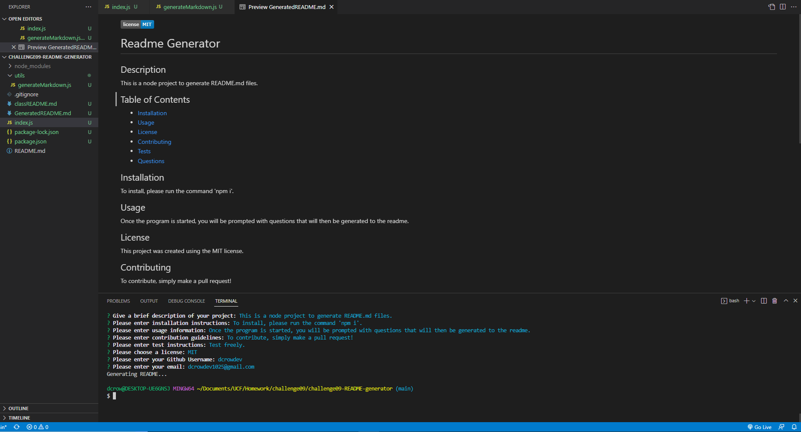

# README GENERATOR

This is a node application to generate a readme file for your project!

[Video of app execution]()

## Description

This is our first node.js project. It allows the user to install necessary dependencies and generate
a high-quality README.md file after a series of prompts.

### Installing

To install dependencies, simply run the command 'npm i'.

### Executing program

To execute the program run the command, 'node index.js'.

## Authors

Dylan Crowley:

[Github](https://github.com/dcrowdev)  
[Twitter](https://twitter.com/dcrowdev)  
[LinkedIn](https://www.linkedin.com/in/dylan-crowley-3974b8252/)  
dcrowdev1025@gmail.com

## License

This project currently has no license.

## Acknowledgments

UCF Fullstack bootcamp!